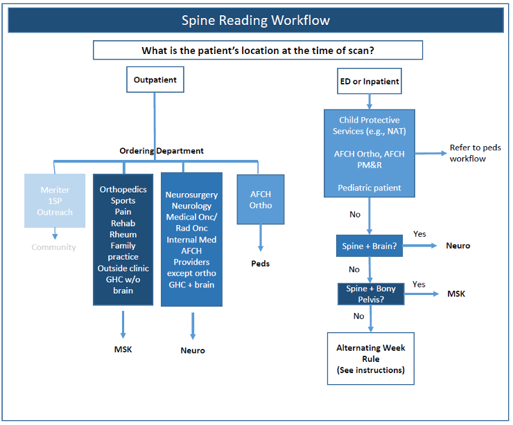
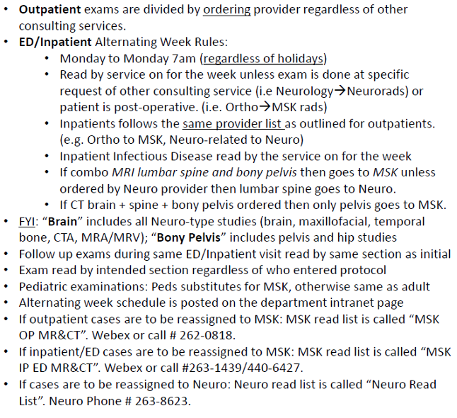

# Spine Imaging Workflow

Routing for spine studies depends on patient location (outpatient vs. ED/inpatient), the ordering department, and — for ED/inpatient — the alternating Ortho spine surgery week. Use the flowchart below; rules image has the detail.

## Routing flowchart

## Detailed rules

